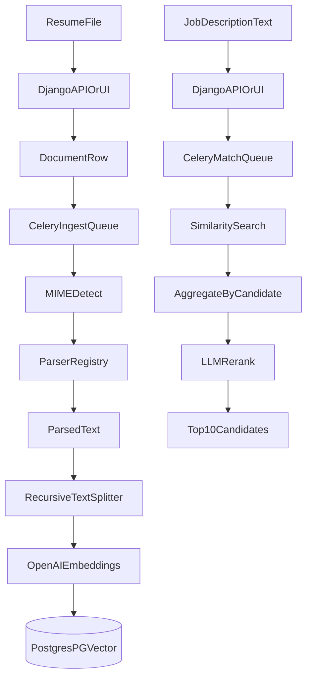

# DESIGN

## Overview

This project is a thin-slice recruiting system POC for AI-native candidate matching at scale. It replaces keyword matching with a retrieval-and-rerank pipeline:

1. ingest raw resume files
2. parse them using a MIME-routed parser registry
3. chunk and embed the extracted text
4. store candidate chunks in Postgres `pgvector`
5. retrieve relevant candidate evidence for a job description
6. rerank candidates into a Top 10 list

The local implementation is intentionally simple, but the system boundaries are chosen so the design can scale.

## Local POC Architecture

- Django serves the API, admin, and the simplest UI at `/`
- Celery runs asynchronous ingestion and matching jobs
- Redis is the local broker and result backend
- Postgres stores both relational application data and vector embeddings
- Local disk stores uploaded files in `media/`
- LangChain wraps OpenAI embeddings, PGVector access, chunking, and rerank model calls

## Data Model

### Candidate

Stores candidate identity and a short headline.

### Document

Stores the uploaded resume file and ingestion metadata:

- original filename
- MIME type
- parser used
- extracted text
- SHA-256 hash
- parse status and any error
- parser metadata and indexing timestamp

### DocumentChunk

Stores per-chunk relational metadata so the app can inspect indexed content:

- chunk index
- chunk text
- start index
- vector document ID
- metadata copied into the vector store

### JobRequest

Represents one ranking request for a job description.

### CandidateMatch

Stores the ranked Top 10 output with retrieval score, fit score, final score, explanation, risks, matched skills, and supporting evidence.

## Ingestion Flow

The ingestion job is `apps.ingestion.tasks.parse_and_index_document`.

1. Detect MIME type from file contents or extension fallback.
2. Select a parser from the registry.
3. Parse extracted text from PDF or DOCX.
4. Build chunks with LangChain `RecursiveCharacterTextSplitter`.
5. Store vectors in PGVector using `langchain-postgres`.
6. Store relational chunk rows for inspection and downstream debugging.
7. Mark the document as indexed or failed.

### Why MIME Routing

MIME-based parser selection avoids hard-coding behavior by filename alone. New file types can be added by:

- implementing a parser class
- registering the MIME type in the parser registry

The task orchestration does not need to change.

## Matching Flow

The matching job is `apps.matching.tasks.generate_candidate_matches`.

1. Accept a job description as raw text.
2. Run vector similarity search over candidate chunks.
3. Group chunk hits by candidate.
4. Compute an initial semantic retrieval score using top chunk scores plus a small diversity bonus.
5. Pass the top candidates and their supporting chunks to an LLM reranker.
6. Persist the Top 10 ordered candidate list with explanations.

## Cold Start Accuracy

Cold start is handled directly in the POC design.

- A brand-new job description does not need historical clicks, applications, or recruiter actions.
- The raw job text is used immediately as the retrieval query.
- Candidate evidence comes from parsed resume text already stored in PGVector.
- Retrieval finds semantically related experience even when exact keywords differ.
- The rerank step reasons over retrieved evidence, which improves result quality beyond pure nearest-neighbor distance.

This is defensible because ranking quality comes from current semantic content, not historical feedback. Historical signals can later become additive features rather than hard dependencies.

## Why Retrieval Plus Rerank

Pure vector similarity is better than keyword matching, but it can over-weight a few locally similar chunks. The rerank step gives the system:

- cross-skill reasoning
- better ordering for close candidates
- human-readable explanations
- explicit risks and skill gaps

The POC also has a fallback mode. If the rerank LLM is unavailable, the system still returns Top 10 candidates ranked by semantic retrieval score.

## Scaling To Production

The local implementation can evolve to production with the following changes.

### Storage

- replace local media storage with S3 or another object store
- keep content hashes to deduplicate uploads
- version parsed outputs when parser implementations change

### Compute

- split ingestion and matching workers into separate autoscaled pools
- add a dedicated dead-letter queue for repeated failures
- use idempotency keys so retried tasks do not duplicate work

### Data

- keep Postgres with `pgvector` initially if scale remains manageable
- move to a dedicated vector database only if retrieval volume, indexing throughput, or latency demands it
- partition chunk tables and apply retention policies if document volume grows significantly

### Observability

- structured logs with task IDs, document IDs, and job request IDs
- metrics for parser success rate, queue depth, embedding latency, and retrieval latency
- tracing around OpenAI, Celery, and DB calls

### API and Product

- authenticated multi-tenant APIs
- recruiter review workflows
- cached job-request results
- pagination and explanation drill-down for candidate evidence

## Known Failure Modes

### Parser failures

Cause:
- malformed PDFs
- password-protected files
- unsupported layouts

Mitigation:
- explicit failure status
- stored error messages
- parser-specific retries only where safe

### MIME mismatches

Cause:
- wrong extension
- broken uploads

Mitigation:
- content-based MIME detection before extension fallback
- parser registry rejection for unsupported types

### Embedding or LLM outages

Cause:
- OpenAI rate limits
- network issues
- invalid credentials

Mitigation:
- Celery retries with backoff
- fallback retrieval-only ranking when reranking fails
- alerting on sustained failure rates

### Partial indexing

Cause:
- worker crash after parsing but before index completion

Mitigation:
- explicit status transitions
- idempotent reprocessing by document ID
- delete and recreate document chunk rows for a clean re-index

### Queue backlog

Cause:
- ingest spikes
- expensive LLM calls

Mitigation:
- separate queues for ingest and match
- autoscaled workers in production
- request prioritization

### Stale embeddings

Cause:
- parser logic changes
- model changes

Mitigation:
- record parser name and model configuration
- support full re-index jobs per document or per corpus

### Hallucinated rerank explanations

Cause:
- LLM extrapolates beyond supplied evidence

Mitigation:
- strict prompt instructing the model to use only provided evidence
- store supporting chunks beside explanations
- optionally score explanations against retrieved evidence in a later production revision

## Local Validation Strategy

The repo includes:

- focused parser tests
- focused matching-service tests
- `generate_sample_inputs` to create local input files
- `run_sample_pipeline` to run the end-to-end thin slice once local Postgres and Redis are available

This is enough for a working POC while keeping the code explicit and small.
